#Тема нашого проекту:
Наш проект це сайт, який на основі базової ai  моделі  дозволяє створювати, або вибирати вже готові квізи.

#Розробники цього проекту:

Микитенко Петро(тімлід) - "https://github.com/mykytenko-petro/QuizLab"

Зелений Тимофій(кодер №1) - "https://github.com/TymofiiZelenyi"

Михайлюк Іван(кодер  №2) - "https://github.com/Ivan55555555555"

Ісаченко Назар(кодер №3) - "https://github.com/IsachenkoNazar"

Петренко Давид(дизайнер №1) - "https://github.com/Davidptn"

Галкін Єгор(дизайнер №2) - "https://github.com/EgorGalkinORG"

Іванов Іван(дизайнер #3) - "https://github.com/IvanovIvaan"

# Структура проєкту

```mermaid
%%{init: {'theme': 'dark'}}%%
graph TD
    C{QUIZLAB}-->Project;
    C-->__init__.py;
    C-->venv;

    QUIZLAB-->Project;

    Project --> init.py;
    Project --> loadenv.py;
    Project --> login_manager.py;
    Project --> manifest.py;
    Project --> settings.py;
    Project --> urls.py;
    Project --> templates;
    Project --> static;
    static --> base.css;
    templats --> base.html;
   
   
    QUIZLAB --> home_app;
    home_app --> __init__.py;
    home_app --> app.py;
    home_app --> views.py
    home_app --> static;
    home_app --> templates;
    templates --> home.html;
    static --> home.css;

    QUIZLAB --> create_quiz_app;
    create_quiz_app --> __init__.py
    create_quiz_app --> app.py;
    create_quiz_app --> core.py;
    create_quiz_app --> views.py
    create_quiz_app --> static;
    create_quiz_app --> templates;
    static --> create_quiz.css;
    templates --> create_quiz.html;

    QUIZLAB --> registration_app
    registration_app --> __init__.py;
    registration_app --> app.py;
    registration_app --> core.py;
    registration_app --> models.py;
    registration_app --> views.py;
    registration_app --> static;
    registration_app --> templates;
    static --> registration.css;
    templates --> login.html;
    templates --> registration.html;






    



  
    
 

 

    
    %% venv (представим как контейнер метаданных)
    venv-->.env;
    .env-->.gitignore:
    .gitignore-->requirements.txt;
    requirements.txt-->README.md;
    README.md-->manage.py;
    

    style A fill:#706f70,stroke:#333,stroke-width:6px
    style B fill:#706f70,stroke:#333,stroke-width:6px
    style C fill:#4d007d,stroke:#333,stroke-width:6px
```

