# QuizLab

# [english version](#english-version-1)

_QuizLab — це потужна платформа, основна мета якої — підвищення рівня знань і полегшення роботи викладачів._  
_Цієї мети ми досягаємо завдяки використанню AI-технологій та сучасного дизайну, що робить платформу надзвичайно зручною у користуванні._

___
# Навігація  
- [Як запустити проєкт](#як-запустити)
- [Залежності](#залежності)
- [Структура проєкту](#структура-проєкту)
- [Основні концепції](#основні-концепції)
- [Інформація про команду](#інформація-про-команду)

___
### Як запустити  
**Виконуй усі команди в терміналі Git Bash**

```bash
git clone https://github.com/mykytenko-petro/QuizLab.git
```

#### Створення віртуального середовища

```bash
python -m venv venv
```

#### Активація віртуального середовища

##### Для Windows

```bash
source venv/Scripts/activate
```

##### Для macOS

```bash
source venv/bin/activate
```

#### Встановлення залежностей

```bash
pip install -r requirements.txt
```

#### Запуск проєкту

```bash
python manage.py
```

___
### Залежності  
Python-залежності:
- Flask
- Flask-Login
- Flask-Mail
- Flask-Migrate
- Flask-Sessions
- Flask-SQLAlchemy
- dotenv
- openai

___
### Технології
- Python
- Sqlite3
- SMTP
- HTML 
- CSS
- JavaScript
- Jinja2
- dotenv
- Visual Studio Code
- API
- git
- GitHub

___
### Структура проєкту



___
### Основні концепції

- Реєстрація:
  - Валідація введених користувачем email і пароля
  - Збереження пароля (у захищеному вигляді)
  - Додавання користувача в базу даних Sqlite3
  - Надсилання листа з підтвердженням через SMTP
  - Активація облікового запису після підтвердження
  - Автоматичне перебування в системі протягом сесії

- Вхід:
  - Перевірка облікових даних у базі
  - Порівняння хешованих паролів
  - Налаштування сесії користувача

- Квіз:
  - Frontend → API: користувач надсилає дані (назва, питання, відповіді, налаштування)
  - API → Backend: валідація та обробка
  - Backend: створення об'єкта квізу, збереження в базі
  - Backend → API: повернення метаданих про квіз
  - API → Frontend: відображення квізу в інтерфейсі

- Ключові можливості:
  - Управління сесіями через Flask-Session
  - Підтвердження email перед повноцінним доступом

___
### Інформація про команду
- Петро Микитенко: [github.com/mikitenko-petro](https://github.com/mykytenko-petro)
- Назарій Ісаченко: [github.com/IsachenkoNazar](https://github.com/IsachenkoNazar)
- Єгор Галкін: [github.com/EgorGalkinORG](https://github.com/EgorGalkinORG)
- Давид Петренко: [github.com/Davidptn](https://github.com/Davidptn)
- Тимофій Зелений: [github.com/TymofiiZelenyi](https://github.com/TymofiiZelenyi)
- Іван Іванов: [github.com/IvanovIvaan](https://github.com/IvanovIvaan)
- Іван Михайлюк: [github.com/Ivan55555555555](https://github.com/Ivan55555555555)


# English version
_QuizLab is powerful platform which main goal is boosting our knowledge and make teachers work easier_
_we can achieve this goal by using ai technologies and modern design that makes our platform very easy to use_

___
# Navigation
- [How to run project](#how-to-run)
- [Dependences](#dependences)
- [Project Structure](#project-structure)
- [Key concepts](#key-concepts)
-  [Information about our team](#information-about-our-team)

___
### How to run
EXECUTE ALL COMMANDS IN THE GIT BASH TERMINAL

```bash
git clone https://github.com/mykytenko-petro/QuizLab.git
```

#### Creating a Virtual Environment

```bash
python -m venv venv
```

#### Activating the Virtual Environment

##### For Windows

```bash
source venv/Scripts/activate
```

##### For macOS

```bash
source venv/bin/activate
```

#### Installing Dependencies

```bash
pip install -r requirements.txt
```

#### Running the Project

```bash
python manage.py
```

___
### Dependences
python dependencies:
- Flask
- Flask-Login
- Flask-Mail
- Flask-Migrate
- Flask-Sessions
- Flask-SQLAlchemy
- dotenv
- openai

___
### technologies
- Python
- Sqlite3
- SMTP
- HTML
- CSS
- Javascript
- Jinja2
- dotenv
- Visual studio code
- API
- git
- github

___
### Project structure

```mermaid
    graph TD
        A[quizlab]
        
        A --> B[api]
        B --> B1[__init__.py]
        B --> B2[core.py]
        B --> B3[settings.py]
        B --> B4[urls.py]
        
        A --> C[create_quiz_app]
        C --> C1[__init__.py]
        C --> C2[app.py]
        C --> C3[core.py]
        C --> C4[models.py]
        C --> C5[views.py]
        C --> C6[templates]
        C6 --> C61[create_question.html]
        C6 --> C62[create_quiz.html]
        C --> C7[static]
        C7 --> C71[css]
        C7 --> C72[js]
        C72 --> C721[answer]
        C721 --> C7211[createAnswer.js]
        C721 --> C7212[renderAnswer.js]
        C72 --> C722[question]
        C722 --> C7221[createQuestion.js]
        C722 --> C7222[renderQuestion.js]
        C72 --> C723[quiz]
        C723 --> C7231[createQuiz.js]
        C723 --> C7232[renderQuiz.js]

        A --> D[home_app]
        D --> D1[__init__.py]
        D --> D2[app.py]
        D --> D3[views.py]
        D --> D4[templates]
        D4 --> D41[home.html]
        D --> D5[static]
        D5 --> D51[css]
        D51 --> D511[home.css]
        D5 --> D52[js]
        D52 --> D521[home.js]

        A --> E[Project]
        E --> E1[__init__.py]
        E --> E2[db.py]
        E --> E3[login_manager.py]
        E --> E4[manifest.py]
        E --> E5[session_config.py]
        E --> E6[settings.py]
        E --> E7[smtp_setup.py]
        E --> E8[urls.py]
        E --> E9[utils.py]
        E --> E10[templates]
        E10 --> E101[base.html]
        E10 --> E102[page_not_found.html]
        E --> E11[static]
        E11 --> E111[css]
        E111 --> E1111[base.css]
        E11 --> E112[icons]
        E112 --> E1121[colba.png]
        E112 --> E1122[default.png]
        E11 --> E113[js]
        E113 --> E1131[utils.js]
        E --> E12[instance]
        E12 --> E121[data.db]

        A --> F[registration_app]
        F --> F1[__init__.py]
        F --> F2[apps.py]
        F --> F3[models.py]
        F --> F4[views.py]
        F --> F5[templates]
        F5 --> F51[email_confirmation_in_mail.html]
        F5 --> F52[email_confirmation.html]
        F5 --> F53[login.html]
        F5 --> F54[registration.html]
        F --> F6[static]
        F6 --> F61[css]
        F61 --> F611[registration.css]

        A --> G[.env]
        A --> H[.gitignore]
        A --> I[manage.py]
        A --> J[README.md]
        A --> K[requirements.txt]
```


___
### Key concepts

- Registration:
  - Validate user input (email, password)
  - store password 
  - Store user in Squlite3 database
  - Send email verification via SMTP
  - Activate account upon email confirmation
  - Automaticly stays logged in during whole session

- Login:
Validate credentials against database
Compare passwords
set up users session state to logged in

- Quiz
Frontend → API: User submits quiz data (title, questions, answers, settings)
API → Backend: Validates and forwards quiz creation request
Backend Processing: Creates quiz object, assigns unique ID, stores in database
Backend → API: Returns created quiz with generated metadata
API → Frontend: Sends complete quiz object back to client
Frontend Rendering: Displays created quiz in editable interface

- Key features:
Session management with Flask-Session (server-side cookies)
Email verification requirement

___
### Information about our team
- Петро Микитенко: [github.com/mikitenko-petro](https://github.com/mykytenko-petro)
- Назарій Ісаченко: [github.com/IsachenkoNazar](https://github.com/IsachenkoNazar)
- Єгор Галкін: [github.com/EgorGalkinORG](https://github.com/EgorGalkinORG)
- Давид Петренко: [github.com/Davidptn](https://github.com/Davidptn)
- Тимофій Зелений: [github.com/TymofiiZelenyi](https://github.com/TymofiiZelenyi)
- Іван Іванов: [github.com/IvanovIvaan](https://github.com/IvanovIvaan)
- Іван Михайлюк: [github.com/Ivan55555555555](https://github.com/Ivan55555555555)